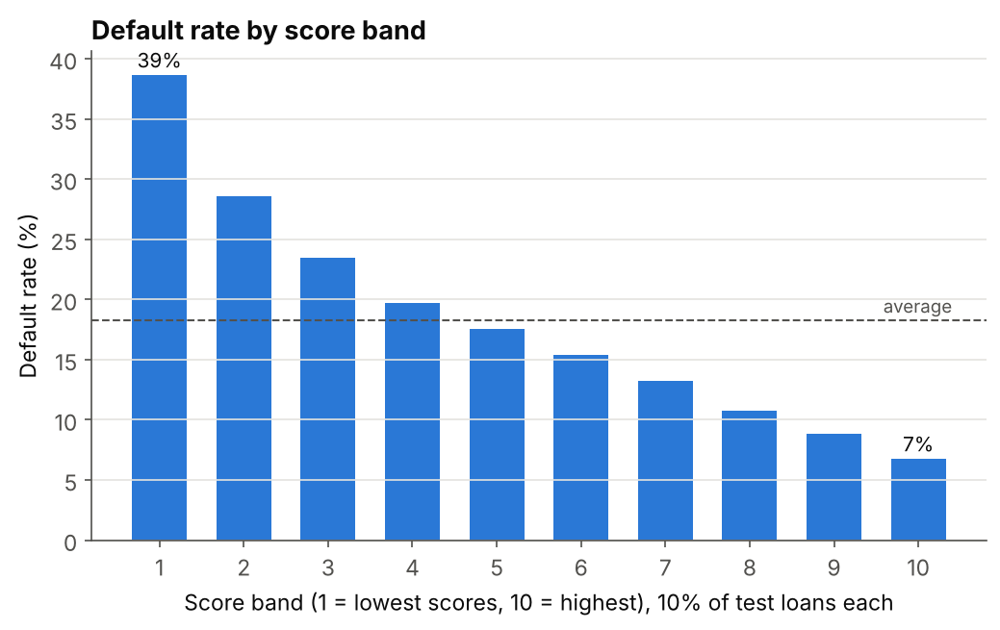
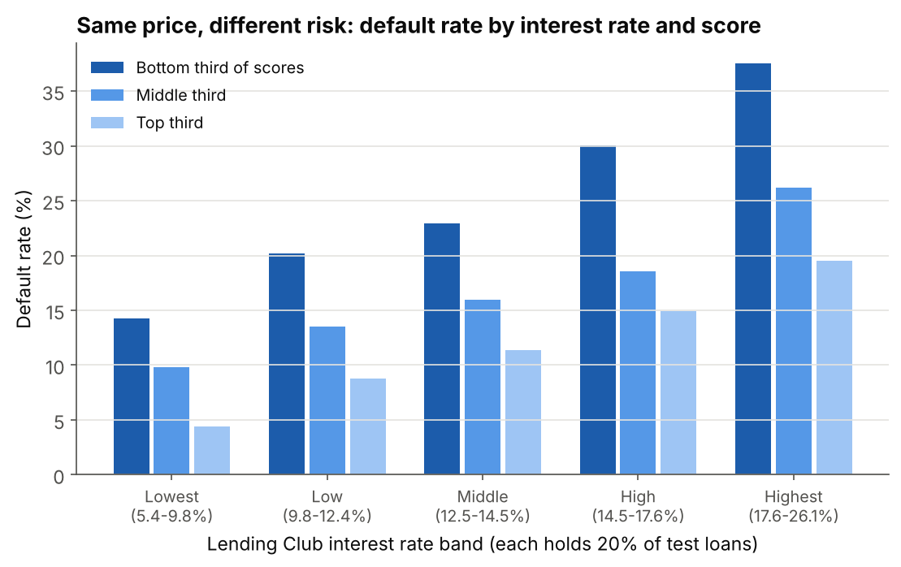
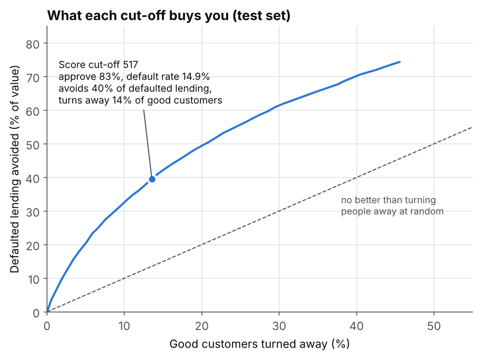

# Lending Club credit risk scorecard

I built a credit scorecard on 164,000 Lending Club personal loans to answer three questions:

1. Using only what a borrower puts on their application, how well can we predict who will default?
2. Does that add anything to the interest rate Lending Club charged?
3. Where should a lender set its approval cut-off?

**Tools:** Python (pandas, scikit-learn, matplotlib). **Methods:** Weight of Evidence binning, Information Value, logistic regression scorecard, gradient boosting, ROC/Gini/KS, calibration, expected loss (PD x LGD x EAD).

The full analysis, with explanations at each step, is in [`credit_risk_scorecard.ipynb`](credit_risk_scorecard.ipynb).

## Results

All results are on a 30% test set (49,197 loans) that wasn't used to build the model.

| Model | Gini | KS |
|---|---|---|
| **Scorecard** (7 variables, logistic regression) | **0.35** | **0.25** |
| Gradient boosting (challenger) | 0.37 | 0.27 |
| Lending Club's own interest rate | 0.35 | 0.25 |
| Scorecard and interest rate combined | 0.40 | |

- **It ranks risk as well as Lending Club's pricing did**, using application data only, even though Lending Club's rates also drew on credit bureau scores.
- **It ranks smoothly and its probabilities are accurate.** Default rates fall steadily from 38.7% in the lowest-scoring 10% of loans to 6.8% in the highest. Predicted default rates were within 0.7 percentage points of the actual rate in every band.
- **I'd still pick the scorecard over gradient boosting**, despite its slightly lower Gini, because every point it gives can be explained to a customer or a regulator.



### Same price, different risk

Within every interest rate band, applicants in the bottom third of scores defaulted roughly twice as often as those in the top third. Lending Club was charging similar prices for quite different risks, and combining its rate with the scorecard lifts the Gini from 0.35 to 0.40.



### Choosing a cut-off

With a risk appetite of keeping the default rate of approved loans below 15%:

| | Approve everyone | Score cut-off 517 |
|---|---|---|
| Applicants approved | 100% | 83% |
| Default rate | 18.3% | 14.9% |
| Defaulted lending avoided | | 40% |
| Good customers turned away | | 14% |
| Expected loss rate (LGD assumed 60%) | 11.8% | 9.3% |



## Approach

1. **Cleaning:** grouped rare categories and converted the loan term to months. Missing values get their own band rather than being filled in.
2. **Interest rate left out of the model:** Lending Club set it from its own credit model, so including it would mostly copy theirs. I used it as a benchmark instead.
3. **Binning:** started each numeric variable with ten equal-sized bands, then merged them until every band held at least 5% of loans and the default rate moved in one direction only.
4. **Variable selection:** kept variables with Information Value of at least 0.02 and checked that none were highly correlated (the highest was 0.45).
5. **Scorecard:** logistic regression on the WoE values, scaled so that 600 points = 50:1 odds of being good and every 20 points doubles the odds. The points table is in [`outputs/scorecard.csv`](outputs/scorecard.csv).
6. **Testing:** Gini, KS and calibration on the test set, against gradient boosting and Lending Club's interest rate.
7. **Decisions:** cut-off table with default rates, defaulted lending avoided, good customers lost and expected loss ([`outputs/cutoff_strategy.csv`](outputs/cutoff_strategy.csv)).

## Limitations

- **No loan dates in this version of the data**, so there's no out-of-time test (build on older loans, test on newer ones), which is how banks normally validate a scorecard.
- **Only approved loans.** We never see how rejected applicants would have behaved (the reject inference problem), so the model is less certain at the very bottom of the score range.
- **LGD is assumed** at 60% because recoveries aren't recorded here, so expected loss figures are indicative.
- **No credit bureau data**, which would normally be the strongest predictor in a real scorecard.

## Data

163,987 Lending Club loans issued from 2007 to June 2015, keeping only loans with a known outcome (repaid or defaulted). This is the cleaned version published by H2O.ai in [h2oai/app-consumer-loan](https://github.com/h2oai/app-consumer-loan). The notebook downloads it automatically into `data/`.

## Running it

```
pip install -r requirements.txt
jupyter notebook credit_risk_scorecard.ipynb
```
